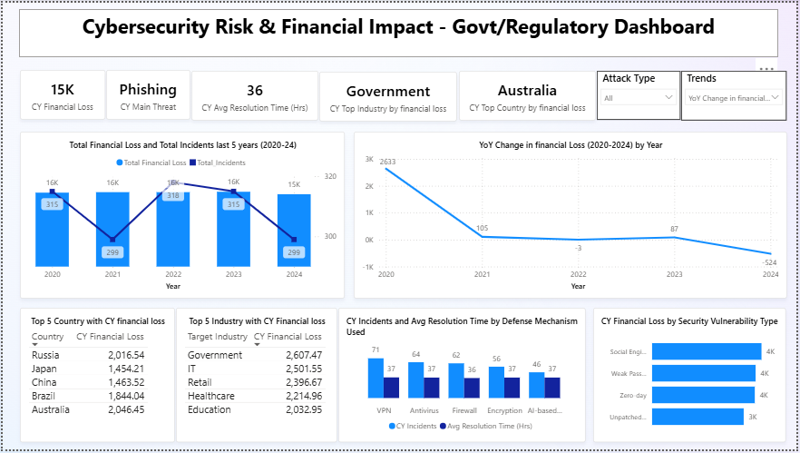

# 🔐 Cybersecurity Risk & Financial Impact – Dashboard

## 📌 Objective

This project delivers an **executive-level cybersecurity dashboard** to track **financial impact, threat patterns, and defense effectiveness**.  
The dashboard is designed for **government, regulatory bodies, and enterprise security teams** to evaluate **cyber risk exposure**, **industry vulnerabilities**, and **resolution efficiency**.

---

## 📂 Dataset

- **Source:** [Global Cybersecurity Threat & Financial Loss Dataset (2015–2024) - Kaggle](https://www.kaggle.com/datasets/atharvasoundankar/global-cybersecurity-threats-2015-2024)
- **Period Covered:** 2020 – 2024 (latest 5 years shown in trends)  
- **Scope:** Financial losses, incident counts, industries, defense mechanisms, and vulnerability types  

## 📊 Dashboard Structure

### **Top KPIs (Current Year)**  
- **CY Financial Loss:** 15.43K  
- **CY Main Threat:** Phishing  
- **CY Avg Resolution Time:** 36 days  
- **CY Top Industry by Loss:** Government  
- **CY Top Country by Loss:** Australia  

### **Trends & Year-on-Year (YoY) Changes**  
- **5-Year Trend (2020–2024):** Total financial loss and incidents across years  
- **YoY Change in Loss:** Positive and negative shifts in financial loss compared to the previous year  

### **Deep-Dive (Current Year Focus)**  
- 🌍 **Top 5 Countries by Financial Loss:** Russia, Japan, China, Brazil, Australia  
- 🏢 **Top 5 Industries by Financial Loss:** Government, IT, Retail, Healthcare, Education  
- 🛡️ **Defense Mechanisms:** Incidents handled vs average resolution time (VPN, Antivirus, Firewalls, Encryption, AI-based tools)  
- ⚠️ **Loss by Vulnerability Type:** Social engineering, weak passwords, zero-day exploits, unpatched systems  

---

## 📈 Key Insights

- 🏢 **Government sector** experienced the highest financial losses (~2.6M), highlighting its vulnerability to cyberattacks.  
- 🌍 **Russia and Australia** recorded the largest country-level financial losses (>2M each).  
- 📉 **2024 shows a drop of -524 in YoY financial loss**, though incident volumes remain steady, pointing to better containment measures.  
- 🛠️ **VPN and antivirus-related incidents** take the longest to resolve (>60 hrs), signaling inefficiencies in traditional defense methods.  
- ⚠️ **Social engineering** is the top vulnerability type, driving >4K in losses, followed by weak passwords and zero-day exploits.  

---

## 📷 Dashboard Snapshot

  

---

## 🧠 Business Use Case

This dashboard enables **governments, regulators, and CISOs** to:  
- Track **cybersecurity financial losses and incident trends**  
- Compare **YoY changes** to detect rising or falling threats  
- Identify **high-risk industries and countries** for targeted defense strategies  
- Assess **effectiveness of defense mechanisms** and resolution times  
- Prioritize resources based on **vulnerability types causing maximum damage**  

---

## 🙋‍♂️ About Me

**Kanishka Narayan Choudhury**  
Aspiring Data Analyst | SQL | Excel | Power BI | Python  
🔗 [LinkedIn Profile](https://www.linkedin.com/in/kanishka-n-choudhury/)

---
